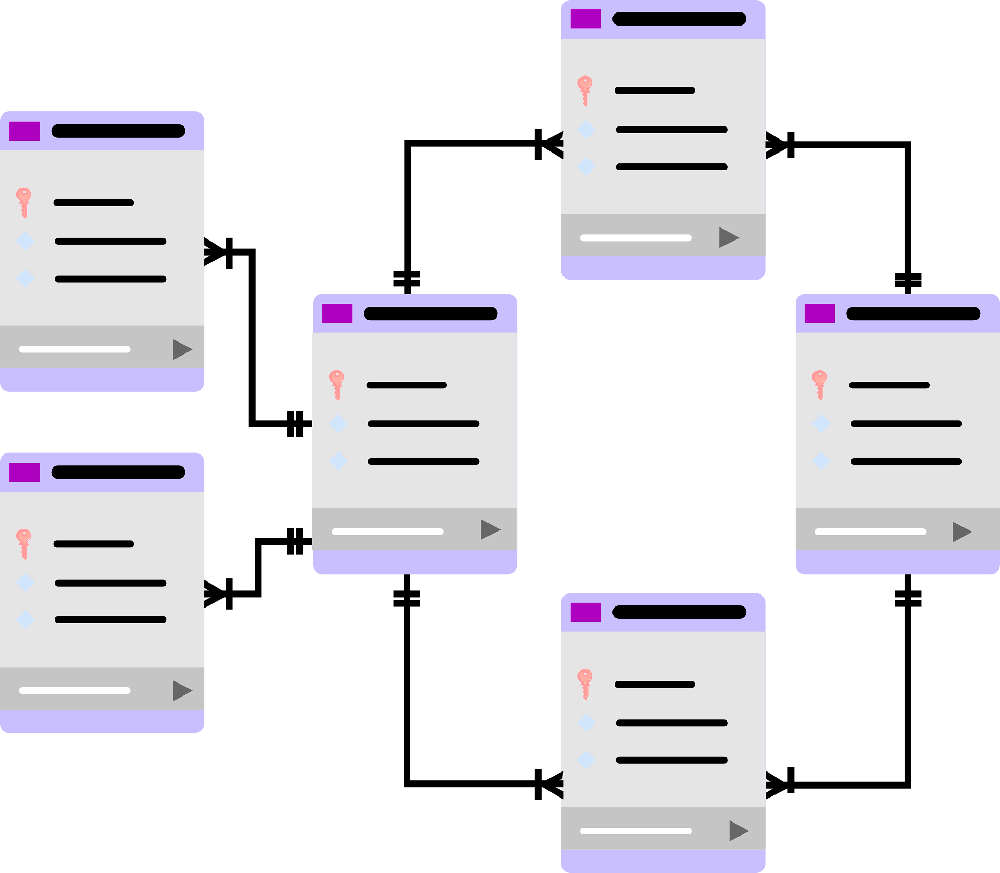

  

 

### ✨ Android & Java Developer | Tech Enthusiast ✨

---

## ✨ Sobre mí

¡Hola! Soy una persona **trabajadora y entusiasta** que disfruta enormemente del **trabajo en equipo**. Me encuentro en una etapa de crecimiento constante, con el objetivo de **aprender lo máximo posible** y absorber nuevos conocimientos cada día.

Aunque estoy en pleno desarrollo de mi carrera y no me considero una experta, tengo muchísima ilusión por **volcar mi creatividad y mis conocimientos** en el ámbito de la informática. Me apasiona ver cómo las ideas cobran vida a través del código, especialmente en el ecosistema **Android** y **Java**. Busco oportunidades donde pueda aportar mi energía, colaborar con otros y seguir formándome como profesional en un entorno tecnológico.

* 🔭 **Actualmente:** Enfocada en mis proyectos académicos y perfeccionando mi lógica en Java.
* 🌱 **Mi objetivo:** Aprender tecnologías punteras y mejorar mis habilidades en el desarrollo de interfaces.
* 💬 **Hablemos de:** Java, Android Studio y cómo la creatividad puede transformar el software.
* ⚡ **Actitud:** Siempre lista para un nuevo reto y para aprender de los mejores.

---

## 🛠️ Mi Stack Tecnológico

**Lenguajes y Desarrollo Mobile**

  

**Bases de Datos y Entornos**

  

---
## 🌸 Áreas de Interés

<table align="center" border="0">
  <tr>
    <td align="center" width="33%">
      
       
      <strong>Android Studio</strong>
       
      Creando Apps Nativas
    </td>
    <td align="center" width="33%">
      
       
      <strong>Lógica en Java</strong>
       
      Estructuras y Algoritmos
    </td>
    <td align="center" width="33%">
      
       
      <strong>Bases de Datos</strong>
       
      SQL & Firebase
    </td>
  </tr>
</table>

  <i>"Transformando ideas en código, píxel a píxel"</i> ✨

---

## 💗 Conectemos

  
  

